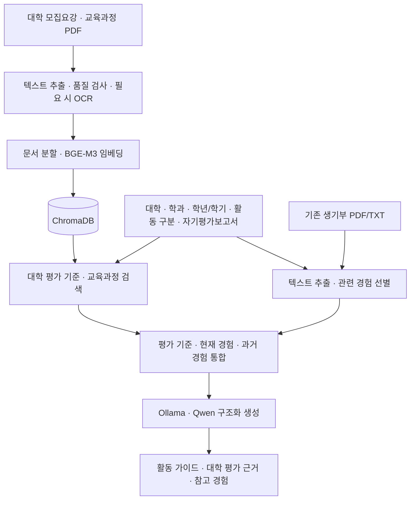

# 유니브릿지 · UniBridge

**목표 대학의 평가 기준과 학생의 경험을 연결하는 RAG 기반 활동 가이드**

자기평가보고서 초안과 기존 학교생활기록부를 바탕으로, 현재 교육과정과 희망 대학의 학생부종합전형 평가 기준에 맞춘 **다음 학기 보완 활동**을 설계하는 Streamlit 앱입니다.

## 발표 자료 및 시연

| 자료 | 내용 |
| --- | --- |
| [프로젝트 발표 자료](docs/presentation.pdf) | 서비스 배경, 유스케이스, 데이터 흐름, 기술 스택, 개선 방향 · PDF 22쪽 |
| [시연 영상](docs/demo.mp4) | 앱 입력부터 활동 가이드 결과 확인까지 · MP4 |


## 프로젝트 소개

학생부종합전형을 준비하는 학생은 대학마다 다른 평가 항목과 반영 비율을 확인하고, 자신의 활동을 어떤 방향으로 확장할지 판단해야 합니다. 유니브릿지는 대학 평가 기준과 교육과정을 검색해 이 과정을 돕습니다.

RAG로 관련 문서를 찾아 LLM에 함께 전달하고, **과거 경험 → 현재 활동 → 미래 계획**을 연결합니다. 학생이 이미 수행한 경험을 출발점으로 삼아 다음 학기에 실천할 목표와 실행 방법을 제안합니다.

### 주요 기능

- **대학 맞춤 활동 설계:** 모집요강의 평가 항목·평가요소·반영 비율을 반영한 보완 활동을 제안합니다.
- **관련 경험 검색:** 기존 생기부에서 현재 활동과 이어지는 경험을 찾아 선정 이유를 설명합니다.
- **교육과정 연계:** 관련 과목과 학습 개념을 참고해 희망 학과와의 연결 방향을 제시합니다.
- **단계별 실행 계획:** 학기 초·중·말의 구체적인 행동, 결과물, 성장 확인 기준을 제공합니다.
- **문서 처리:** PDF 텍스트 추출 품질을 검사하고 필요한 경우 OCR로 보완합니다.

## 목차

- [입력값](#입력값)
- [사용 방법](#사용-방법)
- [결과](#결과)
- [동작 구조](#동작-구조)
- [기술 스택](#기술-스택)
- [주요 파일](#주요-파일)
- [설치](#설치)
- [최초 실행](#최초-실행)
- [설정 및 데이터 관리](#설정-및-데이터-관리)
- [테스트](#테스트)
- [문제 해결](#문제-해결)
- [한계 및 향후 개선](#한계-및-향후-개선)

## 입력값

- 희망 대학교
- 희망 학과
- 현재 학년(1·2학년)과 현재 학기
- 초안의 활동 구분
- 반영을 희망하는 과목(활동 구분이 `세부능력특기사항`인 경우)
- 자기평가보고서 초안
- 기존 생기부 원문(PDF 또는 UTF-8 TXT, 최대 10MB): 1학년 2학기와 2학년만 입력

지원 활동 구분은 `세부능력특기사항`, `동아리활동`, `자율자치활동`, `진로활동`입니다. 현재 성균관대학교, 동국대학교, 경희대학교, 서울시립대학교, 명지대학교, 건국대학교, 가톨릭대학교 모집요강이 등록되어 있습니다.

현재 3학년은 서비스 대상에서 제외합니다. 1학년 1학기는 기존 생기부가 없는 시기로 보고 자기평가보고서의 현재 경험만 사용합니다. 1학년 2학기와 2학년은 기존 생기부의 과거 경험과 자기평가보고서의 현재 경험을 함께 연결하여 다음 학기 활동을 설계합니다.

## 사용 방법

1. 희망 대학교와 학과, 현재 학년·학기를 입력합니다.
2. 초안의 활동 구분을 선택합니다. 세부능력특기사항이라면 반영할 과목도 입력합니다.
3. 자기평가보고서에 수행한 활동, 탐구 과정, 역할, 배운 점을 작성합니다.
4. 1학년 2학기 또는 2학년이라면 기존 생기부 PDF/TXT를 업로드합니다.
5. **대학 맞춤 활동 가이드 생성** 버튼을 누릅니다.
6. 평가 항목별 활동 계획과 근거를 확인합니다.

### 입력 예시

기존 생기부 없이 실행 흐름을 확인할 수 있는 가상의 예시입니다.

| 입력 항목 | 예시 |
| --- | --- |
| 희망 대학 / 학과 | 성균관대학교 / 미디어커뮤니케이션학과 |
| 현재 학년 / 학기 | 1학년 / 1학기 |
| 활동 구분 / 과목 | 세부능력특기사항 / 국어 |
| 자기평가보고서 | 같은 사건을 다룬 두 기사의 제목과 표현을 비교했습니다. 표현 방식이 독자의 해석에 미치는 영향을 정리하고, 모둠 토론에서 비교 결과를 발표했습니다. 자료의 출처를 확인하는 과정이 부족했다고 느꼈습니다. |

입력 후에는 1학년 2학기를 대상으로 평가 항목별 목표, 추천 이유, 실행 단계와 결과물, 성장 확인 기준이 생성됩니다. 실제 문구는 모델의 생성 결과에 따라 달라집니다.

## 결과

1. **활동 가이드**
   - 과거(기존 생기부)·현재(자기평가보고서)·미래(다음 학기 계획)를 구분한 연결 근거
   - 평가 항목과 반영 비율별 다음 학기 보완 목표
   - 희망 학과와의 연결 방향
   - 학기 초·중·말의 구체적인 실행 방법과 결과물
   - 활동 완료 및 성장 확인 기준
2. **근거**
   - 모집요강에서 확인한 평가 항목, 평가요소, 반영 비율
   - 활동 연결에 참고한 기존 생기부 구간

반영 비율은 가이드를 정렬하고 대학의 평가 관점을 설명하는 데 사용합니다. 합격 확률이나 활동 시간 배분을 의미하지 않습니다. 생성된 학과 연결과 미래 활동은 AI의 제안이므로 실제 적용 학년도와 전형은 모집요강 원문에서 다시 확인해야 합니다.

## 동작 구조



기존 생기부 입력·검색 단계는 1학년 1학기에 생략합니다.

### 구현 포인트

- **모집요강 검색:** 여러 질의로 평가 기준을 검색하고, 평가 기준이 발견된 페이지의 청크를 함께 가져와 표의 맥락을 보완합니다.
- **교육과정 검색:** 입력 과목과 일치하는 자료를 우선 조회하고, 없으면 학과·경험을 이용한 의미 검색을 수행합니다.
- **기존 경험 선별:** 여러 검색 결과에 등장한 횟수와 RRF(검색 순위 통합), MMR(관련성과 다양성을 함께 고려)을 활용합니다.
- **구조화 생성:** Pydantic과 JSON Schema로 평가 항목별 출력 형식을 정의합니다.
- **인덱스 갱신:** 문서 내용·메타데이터·임베딩 모델을 반영한 해시로 청크를 식별합니다. 동일한 청크는 재사용하고 신규 청크를 추가하며 사라진 청크는 삭제합니다.
- **자원 관리:** 임베딩 모델은 CPU에서 실행하고, OCR 이후 GPU 메모리를 해제해 LLM 실행에 활용합니다.

## 기술 스택

| 영역 | 기술 |
| --- | --- |
| 언어 / UI | Python 3.12, Streamlit |
| RAG 구성 | LangChain |
| LLM 실행 | Ollama, `qwen3.5:9b` |
| 임베딩 | Hugging Face, Sentence Transformers, `BAAI/bge-m3` |
| 벡터 저장소 | ChromaDB |
| PDF 추출 | pdftotext, PyPDF, PyMuPDF |
| OCR | EasyOCR, RapidOCR / ONNX Runtime |
| 출력 구조 검증 | Pydantic, JSON Schema |
| 테스트 | unittest |

패키지 버전은 [requirements.txt](requirements.txt)에 고정되어 있습니다.

## 주요 파일

| 경로 | 역할 |
| --- | --- |
| `app.py` | 입력 폼과 활동 가이드·근거 화면 |
| `config.py` | 모델, PDF 경로, 평가 기준 페이지 설정 |
| `docs/presentation.pdf` | 프로젝트 발표 자료 |
| `docs/demo.mp4` | 서비스 시연 영상 |
| `rag/future.py` | 다음 학기 계산, 활동 구분별 제약, 가이드 생성 |
| `rag/criteria.py` | 모집요강의 평가 항목과 반영 비율 추출 |
| `rag/attachment.py` | 기존 생기부 PDF/TXT 추출 및 관련 구간 선별 |
| `rag/retriever.py` | 대학 모집요강 검색 |
| `ingestion/build_index.py` | 모집요강·교육과정 검색 인덱스 생성·갱신 |
| `ingestion/pdf_pipeline.py` | PDF 텍스트 추출, 품질 검사, OCR |
| `ingestion/prepare_documents.py` | 문서 전처리, 과목별 교육과정 정리, 청크 분할 |
| `storage/embeddings.py` | 로컬 임베딩 모델 로딩 |
| `storage/vectorstore.py` | 검색용 벡터 저장소 로딩 |
| `data/교육과정.pdf` | 과목별 현재 교육과정 참고 자료 |
| `data/성균관대학교_모집요강.pdf` | 성균관대학교 모집요강 원문 |
| `data/동국대학교_모집요강.pdf` | 동국대학교 모집요강 원문 |
| `data/경희대학교_모집요강.pdf` | 경희대학교 모집요강 원문 |
| `tests/test_future.py` | 미래 가이드 생성 및 UI 테스트 |

## 설치

Windows PowerShell과 Python 3.12 기준입니다. 모든 명령은 `app.py`가 있는 프로젝트 루트에서 실행합니다.

```powershell
py -3.12 -m venv .venv
.\.venv\Scripts\python.exe -m pip install -r requirements.txt
```

Ollama를 설치한 뒤 사용할 모델을 준비합니다.

```powershell
ollama pull qwen3.5:9b
ollama list
```

앱은 기본적으로 `http://localhost:11434`의 Ollama에 연결합니다. Ollama 서버가 실행 중이 아니라면 별도 터미널에서 `ollama serve`를 실행합니다.

검색 임베딩에는 `BAAI/bge-m3`를 사용합니다. 최초 인덱스 생성 시 모델이 로컬 캐시에 없으면 Hugging Face에서 내려받습니다.
기존 생기부 경험은 활동 구분으로 범위를 제한한 뒤, 여러 검색 질의의 상위 결과 Hit와 RRF 순위를 합치고 MMR로 중복을 줄여 선택합니다. LLM은 선택된 원문을 제외하지 않고 경험 제목과 현재 초안과의 연결 이유를 작성합니다.
PDF는 `pdftotext → PyPDF → PyMuPDF` 순서로 텍스트를 읽고 결과 품질을 검사합니다. 텍스트를 충분히 읽지 못한 한글 문서는 EasyOCR 한국어 모델을 우선 사용하고, 필요한 경우 RapidOCR로 보완합니다. EasyOCR 모델이 로컬에 없으면 최초 PDF 분석 시 내려받으므로 인터넷 연결이 필요합니다.

## 최초 실행

먼저 `data/`에 `config.py`에서 지정한 대학별 모집요강과 `교육과정.pdf`가 있는지 확인하고 검색 인덱스를 만듭니다. 모집요강은 등록된 평가 기준 페이지를, 교육과정은 과목별로 정리한 문서를 인덱싱합니다. 동일한 청크의 임베딩은 재사용합니다.

```powershell
.\.venv\Scripts\python.exe -X utf8 -m ingestion.build_index
```

생성된 인덱스는 `vectorstores/`에 저장되며 Git에 포함되지 않습니다. 저장소를 새로 내려받았다면 인덱스 생성이 필요합니다. 최초 실행은 모델 다운로드와 임베딩 처리로 시간이 걸릴 수 있습니다.

그다음 앱을 실행합니다.

```powershell
.\.venv\Scripts\python.exe -m streamlit run app.py --server.address 127.0.0.1
```

브라우저에서 <http://localhost:8501>에 접속합니다. 종료하려면 터미널에서 `Ctrl+C`를 누릅니다.

## 설정 및 데이터 관리

주요 설정은 [config.py](config.py)에서 관리합니다. 기본 실행에 별도의 API 키나 `.env` 작성은 필요하지 않습니다.

| 설정 | 기본값 / 역할 |
| --- | --- |
| `MODEL` | `qwen3.5:9b` |
| `OLLAMA_BASE_URL` | `http://localhost:11434` |
| `EMBEDDING_MODEL` | `BAAI/bge-m3` |
| `COLLEGE_GUIDES` | 대학명과 모집요강 PDF 경로 |
| `COLLEGE_GUIDE_PAGES` | 대학별 평가 기준 페이지, 표지 포함 PDF 뷰어 기준 1부터 시작 |
| `COLLEGE_NATURAL_TEXT_ORDER` | PDF 내부 읽기 순서를 사용하는 대학 |
| `VECTORSTORE_DIRECTORY` | 프로젝트 루트 기준 상대 경로 `vectorstores/` |

### 모집요강 갱신 또는 대학 추가

1. `data/`에 모집요강 PDF를 넣습니다.
2. `config.py`의 `COLLEGE_GUIDES`와 `COLLEGE_GUIDE_PAGES`를 수정합니다.
3. 평가 항목과 비율이 있는 실제 PDF 페이지를 확인합니다.
4. `ingestion.build_index`를 다시 실행하고 앱을 재시작합니다.
5. 결과의 평가 항목·반영 비율이 해당 학년도·전형의 원문과 일치하는지 확인합니다.

교육과정 PDF를 변경했을 때도 인덱스를 갱신합니다. 대학별 컬렉션 이름은 등록 순서로 생성되므로 기존 대학의 순서를 바꾼 경우 전체 인덱스 갱신을 완료한 뒤 앱을 사용합니다.

## 테스트

```powershell
.\.venv\Scripts\python.exe -X utf8 -m unittest discover -s tests -v
```

테스트 코드는 [tests/](tests/)에서 확인할 수 있습니다. 실제 모델을 이용한 생성 품질과 실행 시간은 별도로 앱에서 확인해야 합니다.

## 문제 해결

| 증상 | 확인할 사항 |
| --- | --- |
| Ollama 연결 실패 / 모델을 찾지 못함 | Ollama 실행 여부, `ollama list`의 모델명, `config.py`의 주소·모델 설정을 확인합니다. |
| 평가 기준이나 교육과정을 찾지 못함 | PDF 경로와 평가 기준 페이지를 확인하고 인덱스를 생성·갱신합니다. |
| 생성한 인덱스를 앱에서 읽지 못함 | 인덱스 생성과 앱 실행을 모두 프로젝트 루트에서 수행했는지 확인합니다. |
| PDF 글자가 누락되거나 깨짐 | 스캔 품질과 OCR 결과를 확인하고, 필요하면 내용을 확인한 UTF-8 TXT를 사용합니다. |
| `pdftotext`를 사용할 수 없음 | Poppler의 `pdftotext`가 PATH에 있는지 확인합니다. 사용할 수 없으면 후속 PDF 추출기가 사용됩니다. |
| 생성 시간이 예상보다 오래 걸림 | 최초 모델 다운로드, 스캔 문서 OCR, 모델 실행 자원을 확인합니다. 화면의 남은 시간은 추정치입니다. |

## 한계 및 향후 개선

### 현재 한계

- 현재 기능은 **다음 학기 활동 가이드 생성**입니다. 합격 확률 예측, 성적 분석, 대학 추천, 생기부 작성요령 검증은 제공하지 않습니다.
- 지원 범위는 등록된 모집요강에 한정됩니다. 적용 학년도와 전형은 PDF 원문에서 확인해야 합니다.
- OCR 오류와 생성 오류가 있을 수 있습니다. AI가 제안한 활동은 실제 교육과정 및 학교 활동 여건을 확인해 활용해야 합니다.

### 향후 개선 방향

- 평가 기준 자료 정비 및 지원 대학 확대
- 5등급제에 맞춘 성적 분석과 대학 추천 기능 검토
- 모델 경량화와 실행 환경 최적화를 통한 추론 시간 단축
- 다양한 생기부 형식과 대학별 평가표를 대상으로 검색·생성 품질 검증 확대

`.env`, `.venv`, `vectorstores/`, 임시 파일은 Git 추적 대상에서 제외됩니다. 시연 자료에는 가상 또는 비식별화된 학생 기록을 사용합니다.
